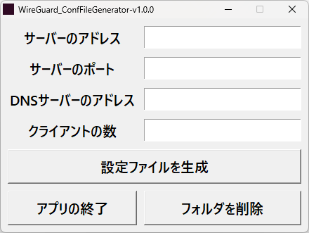

    

    
    
    
    
     
    
    

 

    <strong>最終更新日：２０２４年６月１０日</strong>

<h2>概要</h2>

　WireGuardの設定ファイルを自動で生成します。<a href = "https://github.com/yuito723/WireGuard_ConfFileGenerator/releases/download/v1.0.0/WireGuard_ConfFileGenerator-v1.0.0.zip">こちら</a>のリンクからダウンロードしてください。

<li>実行ファイル名 ： WireGuard_ConfFileGenerator.exe</li>
<li>ライセンスファイル名 ： LICENSE.txt</li>
 

　必要事項を入力して「設定ファイルを生成」ボタンを押すと、「%HOMEPATH%\Desktop\WireGuard_ConfFileGenerator\generated」に設定ファイルが生成されます。 
　「フォルダを削除」ボタンを押すと、「%HOMEPATH%\Desktop\WireGuard_ConfFileGenerator」が削除されます。

<h2>設定ファイルの生成先</h2>
<table>
    <tr>
        <th>パス</th>
        <th>説明</th>
    </tr>
    <tr>
        <td>%HOMEPATH%\Desktop\WireGuard_ConfFileGenerator</td>
        <td>生成したファイルの保存先</td>
    </tr>
    <tr>
        <td>%HOMEPATH%\Desktop\WireGuard_ConfFileGenerator\generated</td>
        <td>生成した設定ファイルの場所</td>
    </tr>
    <tr>
        <td>%HOMEPATH%\Desktop\WireGuard_ConfFileGenerator\keys</td>
        <td>生成した鍵のファイルの場所</td>
    </tr>
</table>

<h2>注意事項</h2>
<li>OSはWindowsのみに対応しています。</li>
<li>WireGuardのデスクトップアプリをインストールしている必要があります。</li>
<li>実行には、管理者権限が必要です。（exeファイルで実行する場合）</li>
<li>「%HOMEPATH%」は、ユーザーのホームフォルダに読み替えてください。</li>
<li>ウイルス対策ソフトにウイルスと判定される場合は、除外設定を行ってください。</li>

<h2>ライセンスについて</h2>

　このPython3プログラムは、オープンソースソフトウェアであり、<a href = "https://github.com/yuito723/WireGuard_ConfFileGenerator/blob/main/LICENSE.txt">GNU General Public License v3.0</a>に基づいて再配布したり改変したりできます。また、GPLライセンスのため、利用する場合は以下のクレジット表記を追加してください。

<pre>(C) 2024 yuito723</pre>
